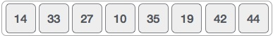
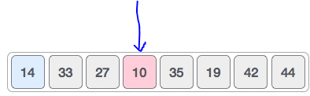
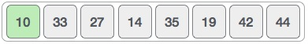
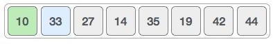
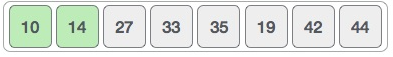
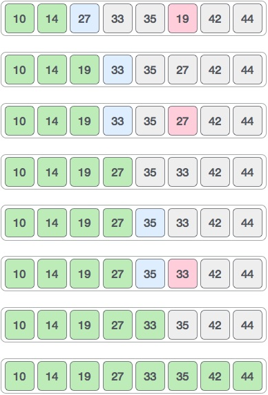

## Selection Sort

> The selection sort algorithm sorts an array by repeatedly finding the minimum element (considering ascending order) from the unsorted part and putting it at the beginning. The algorithm maintains two subarrays in a given array.

1. The subarray is already sorted.
1. Remaining subarray which is unsorted.
   In every iteration of the selection sort, the minimum element (considering ascending order) from the unsorted subarray is picked and moved to the sorted subarray.

- The good thing about selection sort is it never makes more than O(n) swaps and can be useful when memory write is a costly operation.

## Pseudocode
```
SelectionSort(int[] arr)
    DECLARE n <-- arr.Length;
    FOR i = 0; i to n - 1  
        DECLARE min <-- i;
        FOR j = i + 1 to n
            if (arr[j] < arr[min])
                min <-- j;

        DECLARE temp <-- arr[min];
        arr[min] <-- arr[i];
        arr[i] <-- temp;
```
## Trace

* input Array 




1. For the first position in the sorted list, the whole list is scanned sequentially. In the first position where 14 is stored presently, we search the whole list and find that 10 is the lowest value.



2. So we replace 14 with 10. After one iteration 10, which happens to be the minimum value in the list, appears in the first position of the sorted list



3. For the second position, where 33 is residing, we start scanning the rest of the list in a linear manner.



4. We find that 14 is the second lowest value in the list and it should appear at the second place. We swap these values.
After two iterations, two least values are positioned at the beginning in a sorted manner.




5. The same process is applied to the rest of the items in the array.



## Efficency

- Time Complexity: O(n2) as there are two nested loops.
- Auxiliary Space: O(1).
