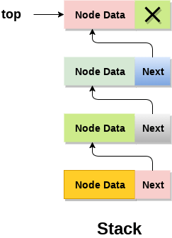

# Stacks and Queues

> Stack is a linear data structure that follows a particular order in which the operations are performed. The order may be LIFO(Last In First Out) or FILO(First In Last Out).

> Queue is a linear structure that follows a particular order in which the operations are performed. The order is First In First Out (FIFO).
.png)

## Challenge

> used types of data structures such as stack and queue and implement many methods on them.

## Approach & Efficiency

I used all methods an application
if statement and return
if all big O equal O(1).

## API

test
