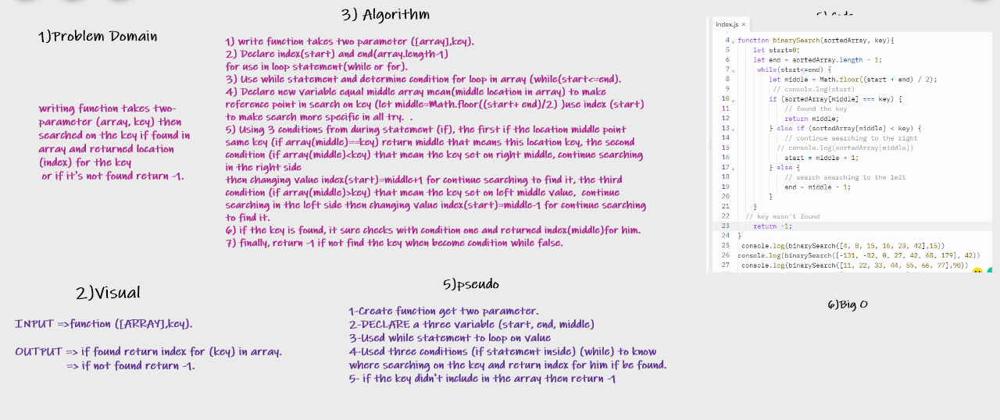

# Binary Search of Sorted Array

> Writing a function called BinarySearch which takes in 2 parameters: a sorted array and the search key, then returned the index of the array’s element that is equal to the value of the search key, or -1 if the element is not in the array.

## Whiteboard Process

## Approach & Efficiency

- Find the middle element of the given array.
- Compare the middle element with the value we are looking for (called key).
- If the key is less than the middle element, search in the left half.
- If the key is more than the middle element, search in the right half.
- If the key is equal to the middle element, return the index of the middle element.
- Continue with steps 1, 2 until we are left with a single element.
- If the key is still not found, return -1.

- The time complexity of the Binary Search is O(log2n), where n is the number of elements in the array

## Stretch Goal.

 >I doing same the steps but allow access to the key of the object for searching him.

- Example: if(binarySearch[middle].number= key).
