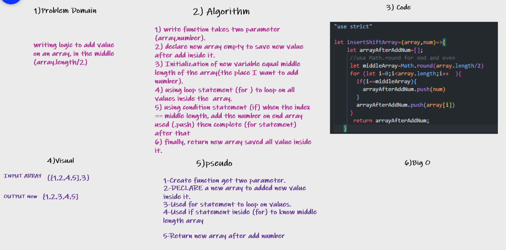

# Insert to Middle of an Array

> Writing a function that takes in an array and a value to be added. Without utilizing any of the built-in methods available, then returning an array with the new value-added at the middle index.

## Whiteboard Process

## Approach & Efficiency

> Used Math.round to solve conflict odd or even for middle length array, after that use for a statement to make a loop on the element during that make if statement inside (for) to determine when I want to add the number on array in the place specific, used push(number) to add on the array, during that for loop worked and added element, finally return new array contains on all element.  
