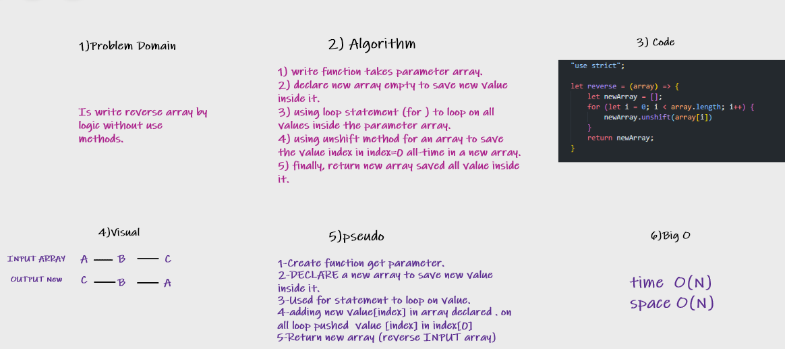

# Reverse an Array

> Writing a function called reverseArray which takes an array as an argument. Without utilizing any of the built-in methods available to your language, return an array with elements in reversed order.

## Whiteboard Process

## Approach & Efficiency

> I used for loop and unshift method for solving the challenge. I using (for)  to work loops for all elements in the input array and at the same time using unshift method to the added element in a new array on all elements adding in index[0] always input new element in the beginning array.

