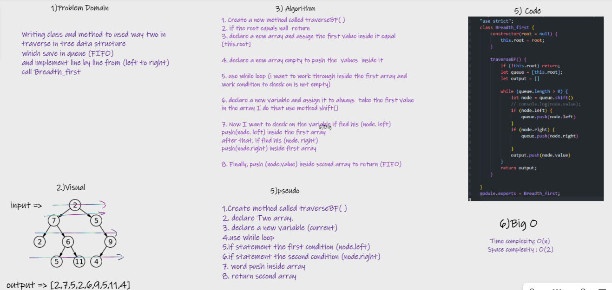
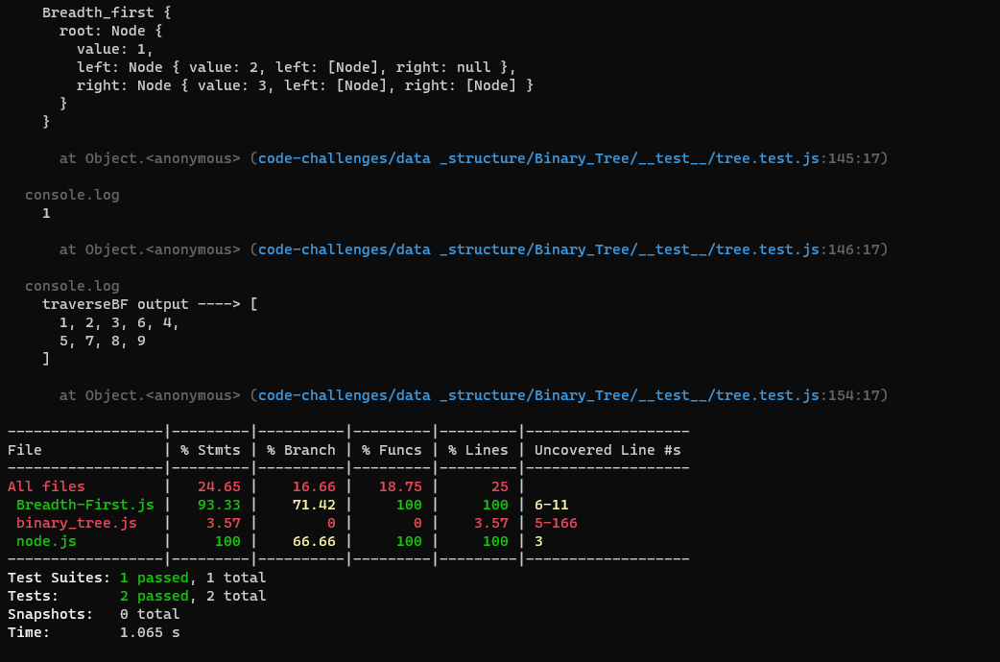

# Challenge Summary

> Writing class and method to used way two in traverse in tree data structure
which save in queue (FIFO)
and implement line by line from (left to right)
call Breadth_first.

## Whiteboard Process

## Approach & Efficiency

I use while loop and if statement

using methods :-

* push(): for add values in last index=>  Big O (1)
* shift(): for remove first element in array =>  Big O (n)

## Solution

