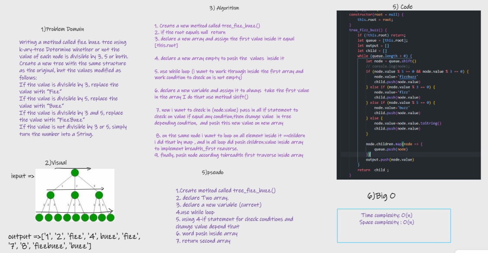

# Challenge Summary

> Write a function called FizzBuzzTree that takes a tree as an argument and creates a new tree with values:
divisible by 3 replaced with Fizz
divisible by 5 replaced with Buzz
divisible by 3 or 5 replaced with FizzBuzz
not divisible by 3 or 5 simply turn number to string
Then return the new tree

## Whiteboard Process

## Approach & Efficiency

Take a tree and make a new one
if value%15==0 value = 'FizzBuzz'

else if value%3==0 value = 'Fizz'

else if value%5==0 value = 'Buzz'

else if value = value.tostring return root node of tree
> methods

* push(): Big O (1)
* shift(): Big O (n)
* toString() :Big O(1)
* map : Big O (n)
* Time O(n)
* Space 0(n)

## Solution

