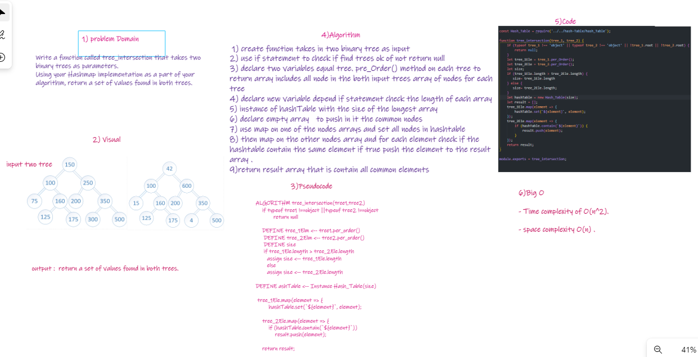
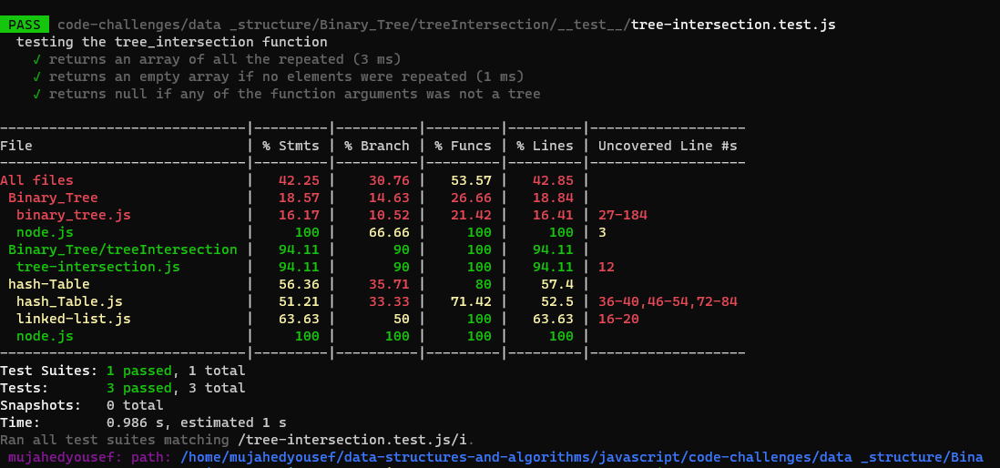

# Challenge Summary

* Writing a function called tree_intersection that takes two binary trees as parameters.
* Using your Hashmap implementation as a part of your algorithm, return a set of values found in both trees.

## Whiteboard Process

## Approach & Efficiency

I used these methods

1. pre_Order() : uses the binary tree  method to return an array of all the node values in the trees
    * time complexity Big : O(n^2)

1. instance HashTable 

1. set(key, value) :  uses method to push all the elements of the biggest tree to the hashtable
    * time complexity Big  : O(n)

1. contain(key) :  uses a method to check if any elements of the second tree exist in the table or not. If so, the values will be pushed to a results array
     * time complexity Big  : O(n)

1. the results array will be returned

## Solution

----
|name|Link|
|----|----|
|PR|[PR](https://github.com/Mujahedyousef/data-structures-and-algorithms/pull/37)|
