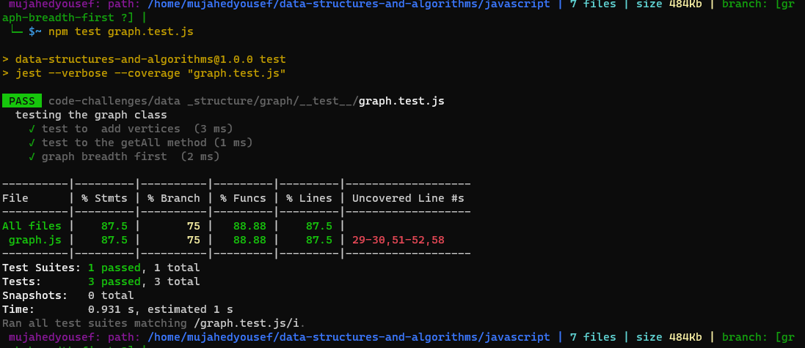

# Challenge Summary

* Writing the following method for the Graph class:

1. breadth first
1. Arguments: Node
1. Return: A collection of nodes in the order they were visited.
1. Display the collection.

## Whiteboard Process

## Approach & Efficiency

* Time Complexity : O(n^2)  
  * using two loops.

* Time Space :O(n)

## Solution

