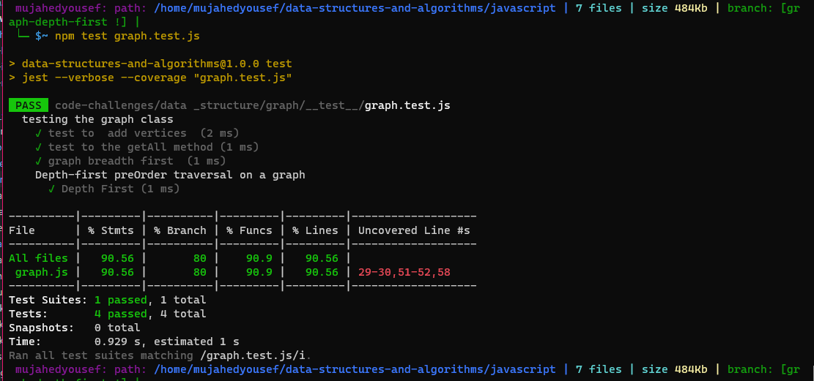

# Depth First Traversal

* It is a recursive algorithm to search all the vertices of a tree data structure or a graph.
* The depth-first search (DFS) algorithm starts with the initial node of graph G and goes deeper until we find the goal node or the node with no children.
Because of the recursive nature, the stack data structure can be used to implement the DFS algorithm.

## Challenge

* Writing the following method for the Graph class:

1. Name: Depth first
1. Arguments: Node (Starting point of search)
1. Return: A collection of nodes in their pre-order depth-first traversal order
1. Program output: Display the collection

## Approach & Efficiency

* Time complexity is O(V+E)
* Space complexity is O(V+E)
* where
  * V is the number of vertices in the graph
  * E is number of edges in the graph.

## Solution

