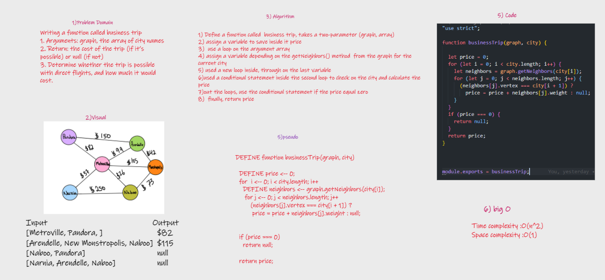
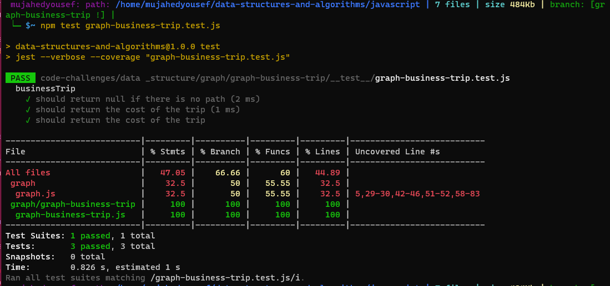

# Challenge Summary

* Writing a function called business trip
* Arguments: graph, the array of city names
* Return: the cost of the trip (if it’s possible) or null (if not)
* Determine whether the trip is possible with direct flights, and how much it would cost.

## Whiteboard Process

## Approach & Efficiency

* Time complexity :O(n^2)
  * used Two loops
* Space complexity :O(1)

## Solution

