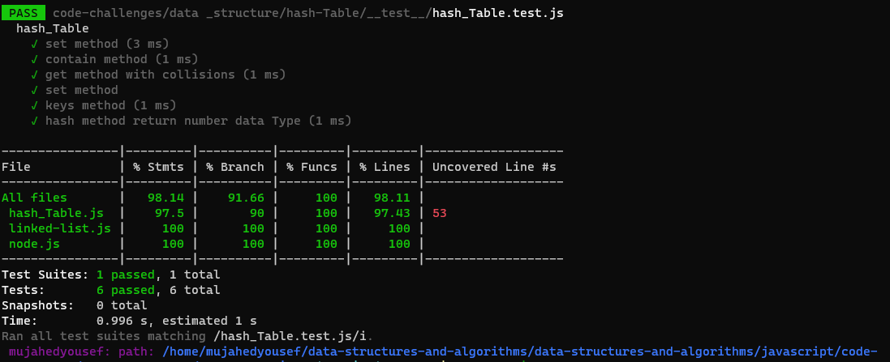

# Hashtables

- allow the storage and retrieval of data in an average time of O(1).
- At its most basic level, a hash table data structure is just an array. Data is stored in this array at specific indices designated by a hash function.
- A hash function is a mapping between the set of input

## Challenge

### Implement a Hashtable Class with the following methods

1. set

- Arguments: key, value
- Returns: nothing
- This method should hash the key, and set the key and value pair in the table, handling collisions as needed.
- Should a given key already exist, replace its value from the value argument given to this method.

2. get

- Arguments: key
- Returns: Value associated with that key in the table

3. contains

- Arguments: key
- Returns: Boolean, indicating if the key exists in the table already.

4. keys

- Returns: Collection of keys

5. hash

- Arguments: key
- Returns: Index in the collection for that key

## Approach & Efficiency

- get method :Retrieving based on a key returns the value stored

  big O
  - time :O(n) //if occur collision become O(n)
  - space :O(1)

* contains method :returns null for a key that does not exist in the hash table and true if its exist

  big O
  - time :O(1) //if occur collision become O(n)
  - space :O(1)

- keys method : returns a list of all unique keys that exist in the hash table

  big O
  - time :O(1)
  - space :O(1)

- hash:return the index of the key value object

  big O
  - time :O(1)
  - space :O(1)
- set:set the key and value pair in the table

  big O
  - time :O(1)
  - space :O(1)

## API

> I used these methods.

- split( ) :

  - Extracts the substrings in this string that are delimited by one or more of the strings in the separator parameter, and returns those substrings as elements of an array.

  - time complexity of .split(" ") will be O(n)

- reduce() :

  - method returns a single value: the function's accumulated result.
  - time complexity of .reduce( ) will be O(n)

- charCodeAt :

  - The method returns the Unicode of the character at a specified index (position) in a string.
  - time complexity of .charCodeAt( ) will be O(1)

- push :

  - The push method appends values to an array
  - time complexity of .push( ) will be O(1)

- Object.keys( ):

  - the method returns an array of a given object's own enumerable property names, iterated in the same order that a normal loop would.
  - time complexity of .Object.keys( ) will be O(n)

## test

----
|name|link|
|----|----|
|PR|[PR](https://github.com/Mujahedyousef/data-structures-and-algorithms/pull/33)|
|README|[Hash table](https://github.com/Mujahedyousef/data-structures-and-algorithms/edit/main/javascript/code-challenges/data%20_structure/hash-Table/hashTable.md)|
