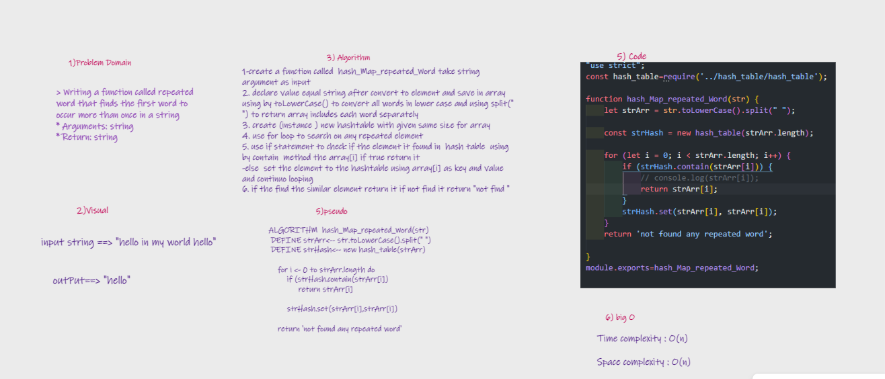
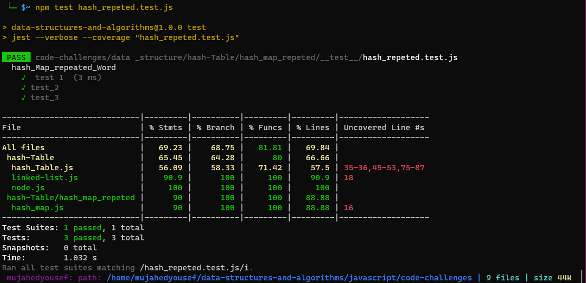

# Challenge Summary
> Writing a function called repeated word that finds the first word to occur more than once in a string
* Arguments: string
* Return: string

## Whiteboard Process

## Approach & Efficiency
I used these methods
* toLowCase( ) :
    - to make all character in string lower case.
    - time efficiency: O(n) 
* split( ) :
   - Extracts the substrings in this string that are delimited by one or more of the strings in the separator parameter, and returns those substrings as elements of an array.

  - time complexity of .split(" ") will be O(n)
* contain( ) : 
    - I make this method to check if the hash table contains on the specific value.
    -  time efficiency: O(n)

* set ( ) :
     - I make this method to set the key and value pair in the table
     - time efficiency: O(n)

## Solution
