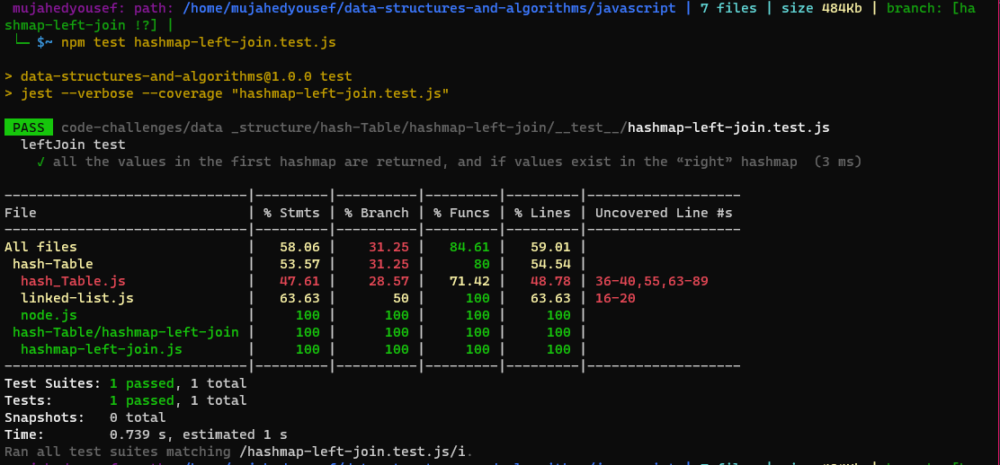
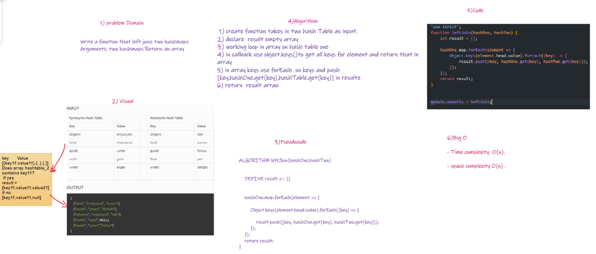

# Hashmap LEFT JOIN

* Writing a function that left joins two hashmaps
* Arguments: two hashmaps Return: an array

## Challenge

Write a function that LEFT JOINs two hashmaps into a single data structure.

* Write a function called left join
* Arguments: two hash maps
* The first parameter is a hashmap that has word strings as keys, and a synonym of the key as values.
* The second parameter is a hashmap that has word strings as keys, and antonyms of the key as values.
* Return: The returned data structure that holds the results is up to you. It doesn’t need to exactly match the output below, so long as it achieves the LEFT JOIN logic

## Approach & Efficiency

* I used these methods
  * Object.keys: it is used to get keys from the object and return an array.
  * forEach( ): it's used to loop through  on the array.

* Time Complexity: O(n).
* Space Complexity: O(n).

## Solution

## Whiteboard

