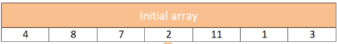
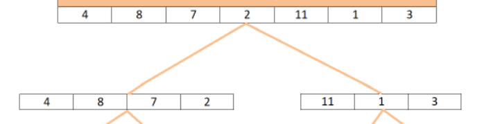
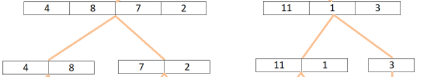
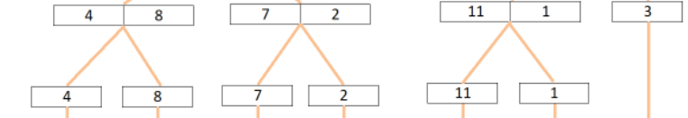
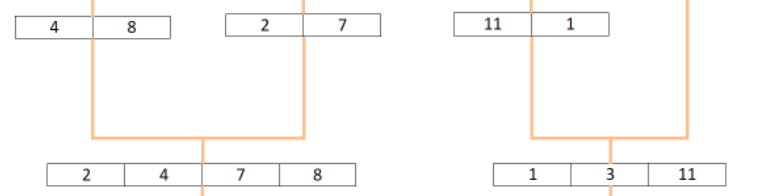
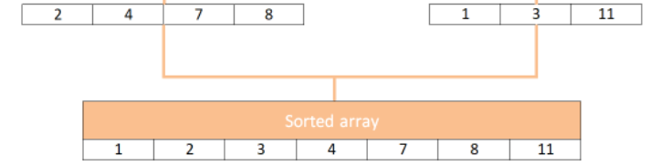

## Merge Sort
> 
 Is a sorting algorithm that uses the “divide and conquer” concept. Given an array, we first divide it in the middle and we get 2 arrays. We recursively perform this operation, until we get to arrays of 1 element
## Pseudocode
````
ALGORITHM Mergesort(arr)
    DECLARE n <-- arr.length

    if n > 1
      DECLARE mid <-- n/2
      DECLARE left <-- arr[0...mid]
      DECLARE right <-- arr[mid...n]
      // sort the left side
      Mergesort(left)
      // sort the right side
      Mergesort(right)
      // merge the sorted left and right sides together
      Merge(left, right, arr)

ALGORITHM Merge(left, right, arr)
    DECLARE i <-- 0
    DECLARE j <-- 0
    DECLARE k <-- 0

    while i < left.length && j < right.length
        if left[i] <= right[j]
            arr[k] <-- left[i]
            i <-- i + 1
        else
            arr[k] <-- right[j]
            j <-- j + 1

        k <-- k + 1

    if i = left.length
       set remaining entries in arr to remaining values in right
    else
       set remaining entries in arr to remaining values in left

````
## Trace
1. sample Array


2. in the first iteration, it will divide the array into two arrays (left & right)


3. after that, by using recursive we will take the left array and divide it again into two arrays (left & right) and continue to do that until an became 1 element inside it.

4. 
5. 
6. 

7. After sorting the right array and the left array Now I want to sort the left array with the right array together for saving in one array according to smallest to bigger.
 

## Efficency
* The time complexity of O(logN)
*  The space O(N). 
----------------
|name|link|
|----|----|
|PR|[PR merge sort]()|
|READ ME|[merge Sort](./mergeSort.md)|