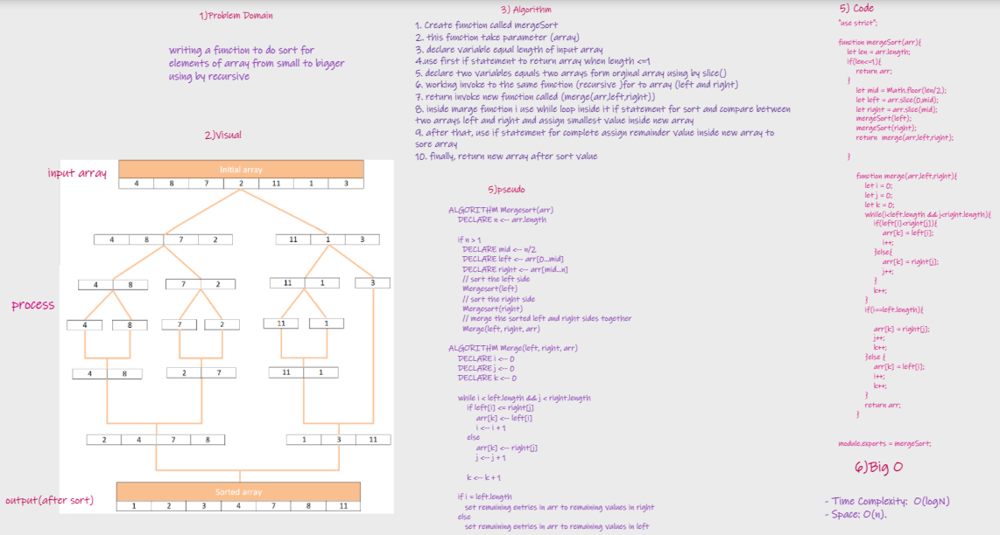
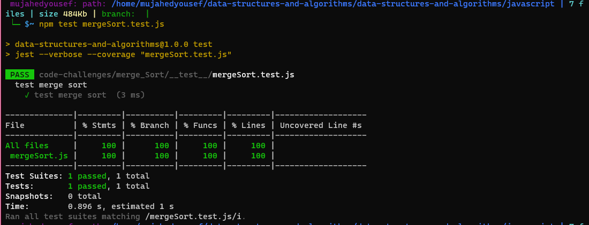

# Challenge Summary
> 
 Is a sorting algorithm that uses the “divide and conquer” concept. Given an array, we first divide it in the middle and we get 2 arrays. We recursively perform this operation, until we get to arrays of 1 element

## Whiteboard Process

## Approach & Efficiency
* The merge sort algorithm has the time complexity of O(logN), meaning that the time required to execute N number of elements will rise in logarithmic proportion. If sorting an array of 10 elements requires 1ms, sorting an array of 100 elements will take 2ms.
* Merge sort is much more efficient in time complexity than the insertion sort, but merge sort also consumes more space because the sorting is not in-place and the recursive call will be threaded. The merge sort will take O(N) space to perform the sorting.

## Solution

