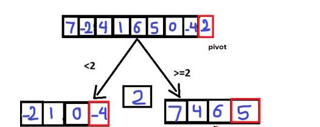
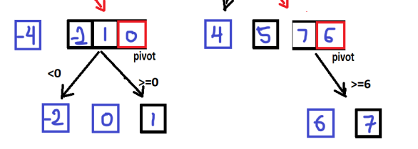

## Quick Sort

> Quick sort follows Divide and Conquer algorithm. It is dividing elements into smaller parts based on some condition and performing the sort operations on those divided smaller parts.

## Pseudocode

```
ALGORITHM QuickSort(arr, left, right)
    if left < right
        // Partition the array by setting the position of the pivot value
        DEFINE position <-- Partition(arr, left, right)
        // Sort the left
        QuickSort(arr, left, position - 1)
        // Sort the right
        QuickSort(arr, position + 1, right)

ALGORITHM Partition(arr, left, right)
    // set a pivot value as a point of reference
    DEFINE pivot <-- arr[right]
    // create a variable to track the largest index of numbers lower than the defined pivot
    DEFINE low <-- left - 1
    for i <- left to right do
        if arr[i] <= pivot
            low++
            Swap(arr, i, low)

     // place the value of the pivot location in the middle.
     // all numbers smaller than the pivot are on the left, larger on the right.
     Swap(arr, right, low + 1)
    // return the pivot index point
     return low + 1

ALGORITHM Swap(arr, i, low)
    DEFINE temp;
    temp <-- arr[i]
    arr[i] <-- arr[low]
    arr[low] <-- temp


```

## Trace

1. input sample array

2. Select an element of the array. This element is generally called the pivot. Most often this element is either the first or the last element in the array.



3. Then, rearrange the elements of the array so that all the elements to the left of the pivot are smaller than the pivot and all the elements to the right are greater than the pivot. The step is called partitioning. If an element is equal to the pivot, it doesn't matter on which side it goes.


4. Repeat this process individually for the left and right sides of the pivot, until the array is sorted.




5. Finally, it will be done sort 


## Efficency

- Time complexity of O(nLogn).

- space complexity O(1) .
----

|name|link|
|----|----|
|PR|[PR Quick sort]()|
|README|[Quick Sort](./quick_sort.md)|
