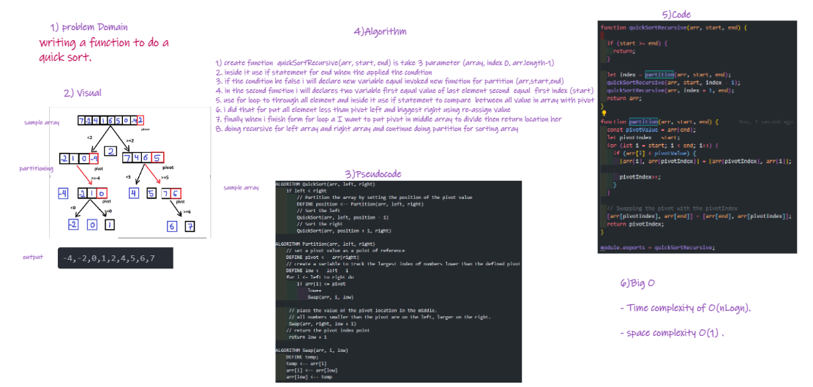

# Challenge Summary

> Quick sort follows Divide and Conquer algorithm. It is dividing elements into smaller parts based on some condition and performing the sort operations on those divided smaller parts.

## Whiteboard Process

## Approach & Efficiency

* Quick Sort in its general form is an in-place sort (i.e. it doesn’t require any extra storage).

* Time complexity of  O(nLogn). 

* Since at any step in the process, it only swaps elements within the array, it uses O(1) space.

## Solution
