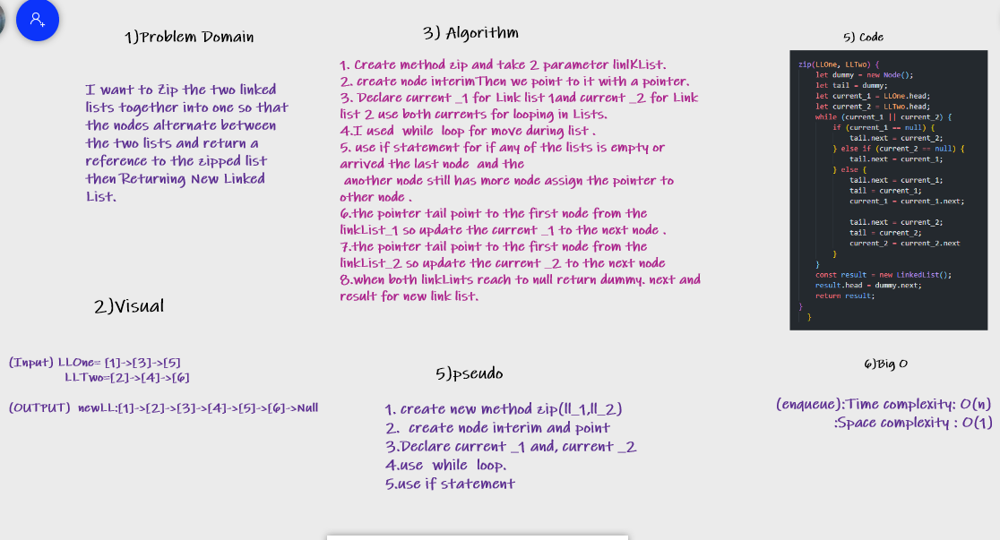

# Challenge Summary

>I want to Zip the two linked lists together into one so that the nodes alternate between the two lists and return a reference to the zipped list then Returning New Linked List.

## Whiteboard Process

## Approach & Efficiency

>I create new method inside class linkedList called zip(){}
>and create two lists then return new one .
>use method

* insert()
* toString()
