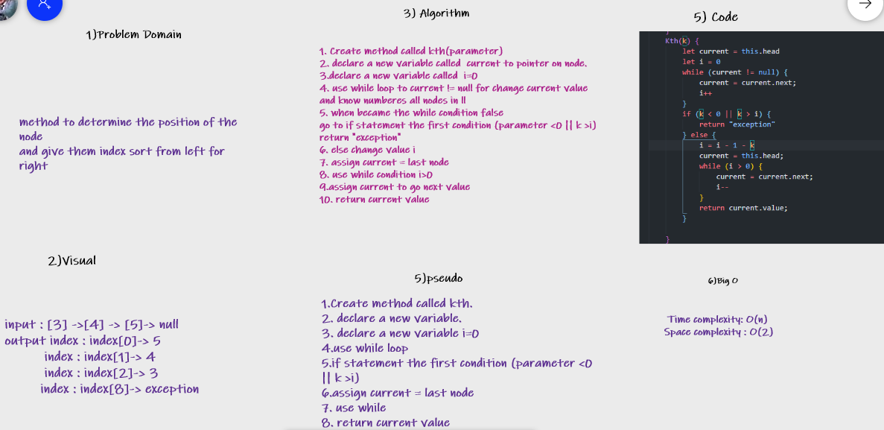
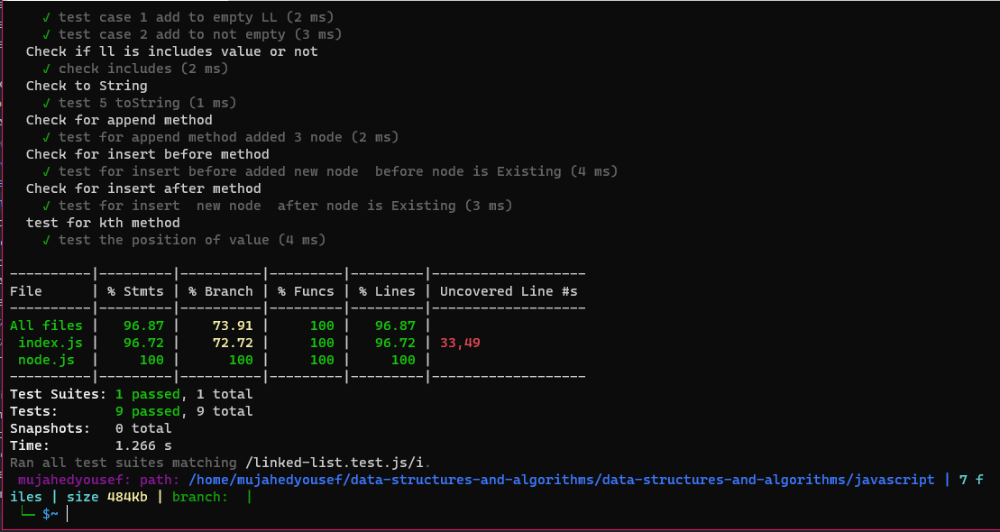

# Challenge Summary

>Create method to determine the position of the node
and give them index sort from left for right.

## Whiteboard Process

## Approach & Efficiency

In this solution, I create a new method
and I used the while loop and if statement.
using methods

* append(value): to add new node to the last node
* kth(value)

## Solution

